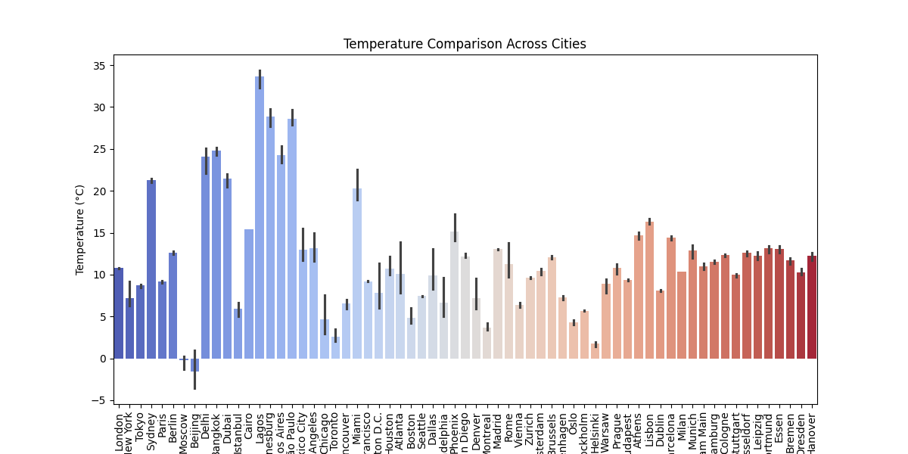
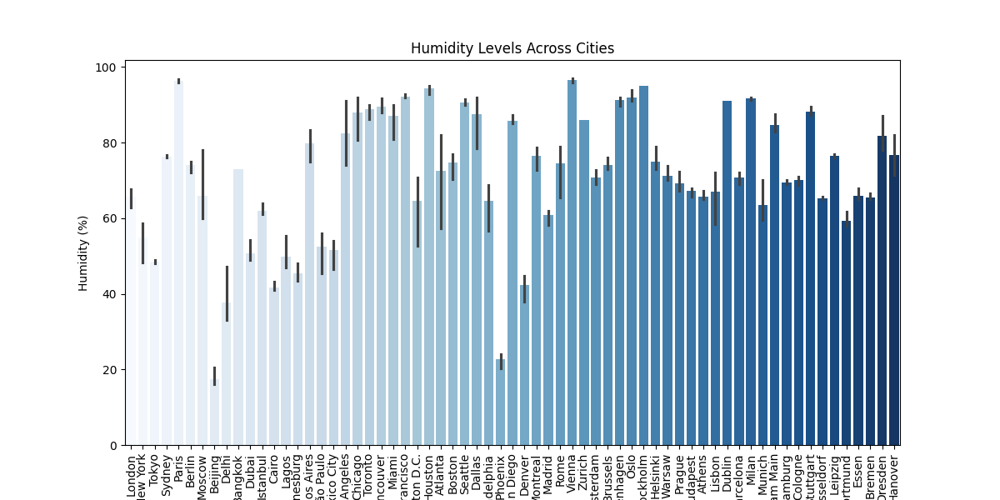
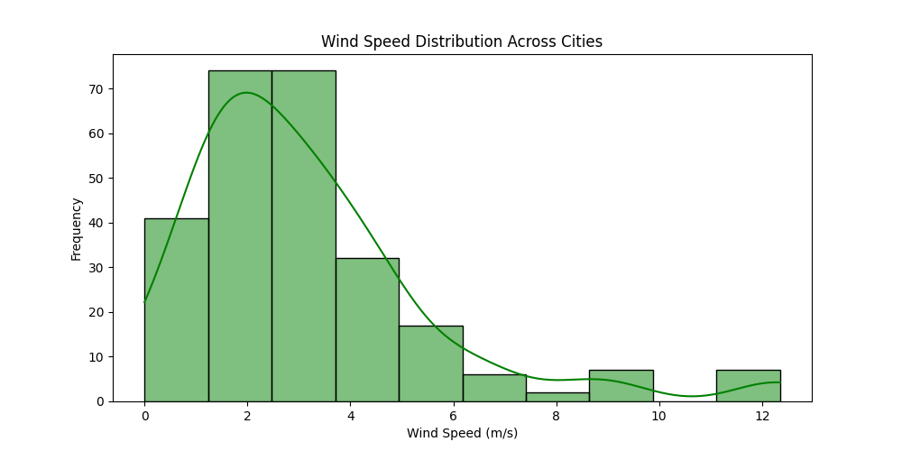
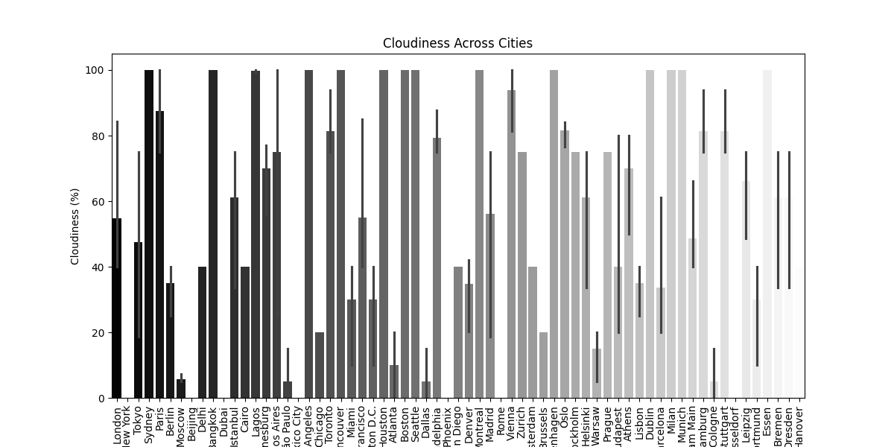

# Weather Data Analysis Report

## Introduction

This project aims to scrape weather data from the OpenWeather API and analyze the trends in temperature, humidity, wind conditions, and other features for multiple cities. The data is fetched for 60+ cities globally and stored in a CSV file. The trends are visualized using Python's `matplotlib` and `seaborn` libraries.

## Data Collection

The weather data is fetched from the OpenWeather API using the `requests` library in Python. The following information is extracted:
- Temperature
- Humidity
- Pressure
- Visibility
- Cloudiness
- Wind Speed
- Weather Description

The data is stored in a CSV file for further analysis.

## Visualization

The weather trends are visualized using line plots and bar plots. The following visualizations are created:
- Temperature Trend
- Humidity Trend
- Wind Speed Distribution
- Cloudiness Across Cities

### Temperature Trend

### Humidity Trend

### Wind Speed Distribution

### Cloudiness Across Cities

## Analysis

The visualizations show the trends in temperature, humidity, wind speed, and cloudiness over time for different cities. The temperature trend plot shows how the temperature varies across cities, while the humidity trend plot shows the changes in humidity. The wind speed distribution plot provides insights into the wind conditions across the cities. The cloudiness plot shows the cloud cover across different cities.

## Conclusion

This project demonstrates how to fetch weather data from an API for multiple cities, store it in a CSV file, and visualize the trends using Python. The analysis provides insights into the weather patterns for the specified cities.
